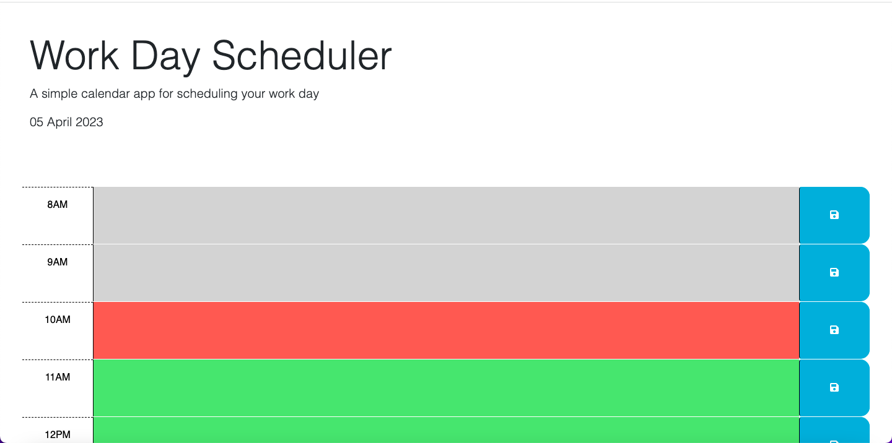

# Work-Day-Scheduler

## Description
My motivation for this project was to better my coding skills for future employment opportunities. I built this project because it worked on new skills that I had learned the week before in the UW-Madison coding bootcamp. With topics like jQuery, dayjs() methods, and bootstrap classes, I was able to better myself as a web developer and learn important concepts. This project solves the need for planning out your day and using your time wisely, which could be useful for many things including how I choose to spend time studying.

## Installation
To install this application go to the url "https://pjt3232.github.io/Work-Day-Scheduler/" on the browser of your choice.

## Usage
To use this application, go to the url "https://pjt3232.github.io/Work-Day-Scheduler/". The application should look like the screenshot below:

From this website, you are able to plan out your day. By clicking on the text area and writing an activity or event that you have planend for that specific time, you are able to save it by clicking on the floppy disk icon to the right of the text area. Even when you refresh the page, if you have saved the event or activity then the text you entered in the text area for a specific time will be there. Please note, the item is only saved in lcoal storage so it won't travel from device to device. This webpage will also have times or evetns that are in the past be colored gray, ones the are on the current hour in red, and the future times or events will be colored green. This way the application can catch your attention and let you know if your planned event has already happened, is this hour, or still coming up in the future.

## Credits
I used a starter code for this project. The starter code is the second commit on my repo and it makes up all of the HTML and CSS code. The entire JavaScript file was worked on by me and I recieved no start code for the script.js file on this project. The creator of the starter code and the location of the starter code on GitHub can be found below:

Creator: goergeyoo@github.com
Link of the starter code: https://github.com/coding-boot-camp/crispy-octo-meme
